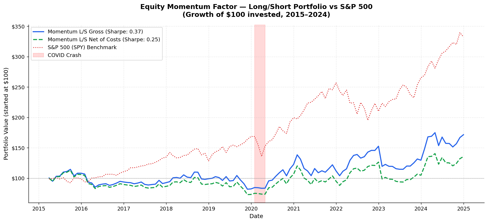
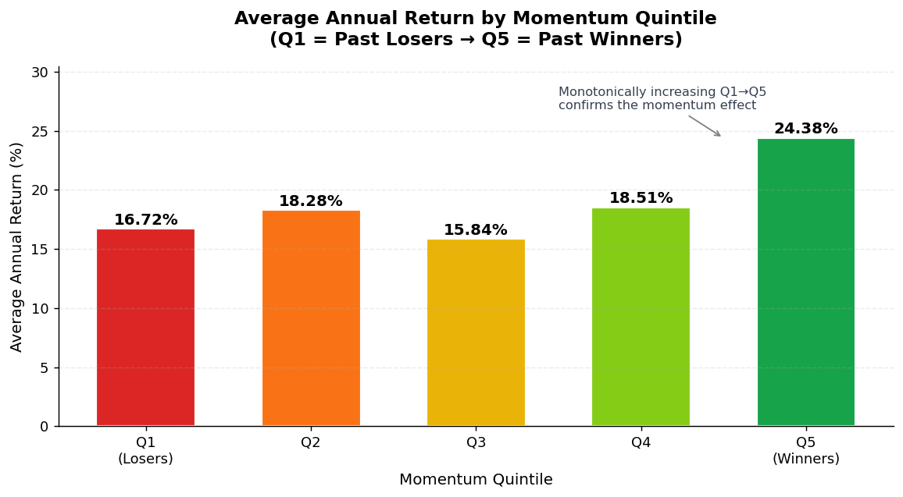
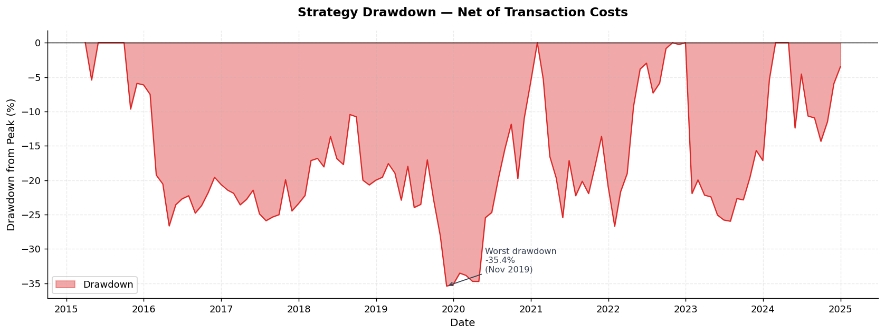
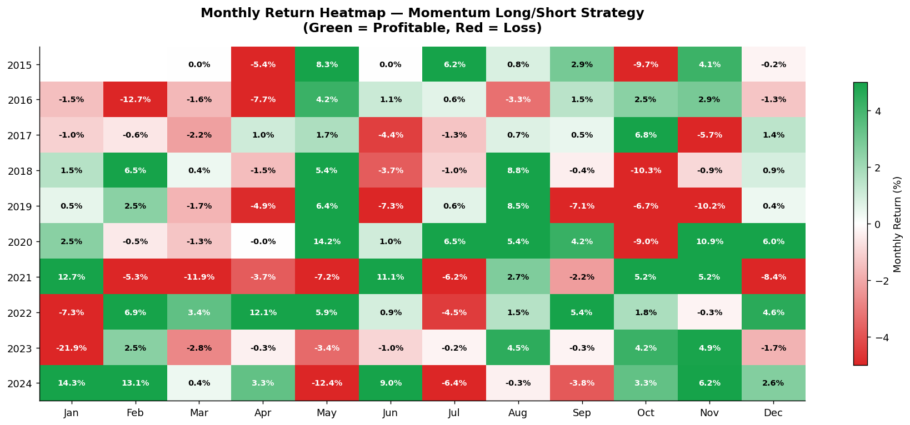
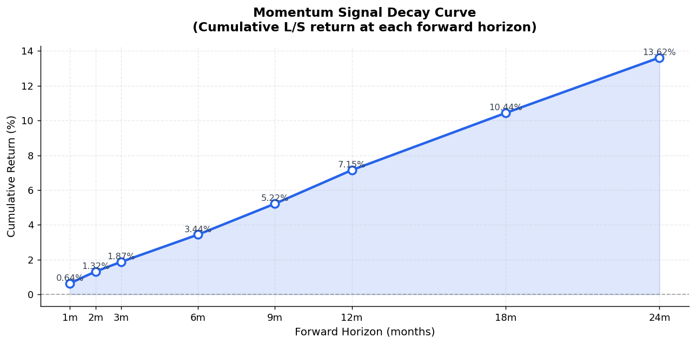

# Equity Momentum Factor Backtest

A systematic cross-sectional momentum strategy backtested on 150 large and 
mid-cap US equities from 2015 to 2024. Built entirely in Python using 
open-source data.

## Strategy Summary

Every month, stocks are ranked by their 12-1 month return (past 11 months, 
skipping the most recent month to avoid short-term reversal). The top 20% 
(Q5 winners) are bought long and the bottom 20% (Q1 losers) are sold short 
in an equal-weighted portfolio. The portfolio is rebalanced monthly.

## Results

| Metric | Value |
|--------|-------|
| Universe | 150 large/mid cap US stocks |
| Period | March 2015 — December 2024 |
| Gross Annual Return | 7.67% |
| Net Annual Return (after costs) | 5.27% |
| Gross Sharpe Ratio | 0.37 |
| Net Sharpe Ratio | 0.25 |
| Max Drawdown | -35.41% |
| Win Rate | 55.9% of months |
| Transaction Cost | 10bps one-way |

## Key Finding

Momentum alpha is significantly stronger in a diverse 150-stock universe 
(including mid-caps) compared to a universe limited to the 98 largest 
mega-cap stocks. In the mega-cap only universe the effect nearly disappears 
— consistent with academic research showing momentum is weaker in heavily 
covered, efficiently priced securities.

## Charts

### Cumulative Return vs S&P 500

### Quintile Return Distribution

### Strategy Drawdown

### Monthly Return Heatmap

### Signal Decay Curve

## Academic Foundation

This project replicates the core findings of:
- Jegadeesh & Titman (1993) — *Returns to Buying Winners and Selling Losers*
- Asness, Moskowitz & Pedersen (2013) — *Value and Momentum Everywhere*

## Tech Stack

- **Python** — pandas, numpy, matplotlib, yfinance
- **Platform** — Google Colab
- **Data** — Yahoo Finance via yfinance

## How to Run

1. Open `Momentum_Factor_Backtest.ipynb` in Google Colab
2. Run all cells top to bottom
3. Charts are saved automatically as PNG files
